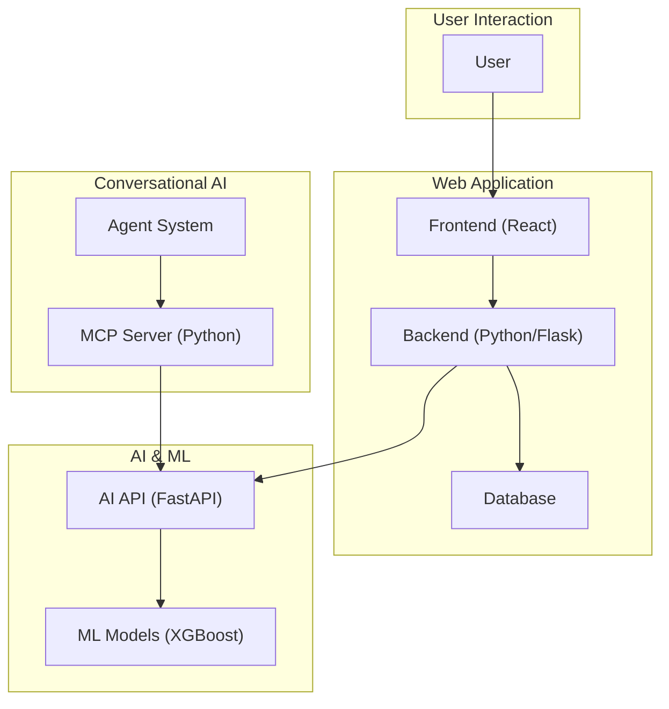

# MedAssist

MedAssist is a comprehensive platform designed to assist medical professionals with real-time predictive model analysis and patient data management. It combines a modern web interface with powerful AI models and a multi-agent system to streamline clinical workflows.

## Table of Contents

- [Project Overview](#project-overview)
- [Architecture](#architecture)
- [Modules](#modules)
  - [Frontend](#frontend)
  - [Backend](#backend)
  - [AI](#ai)
  - [Agent System](#agent-system)
- [Workflow](#workflow)
- [Setup](#setup)
- [API Keys](#api-keys)

## Project Overview

MedAssist provides the following key features:

-   **Predictive Analysis:** Offers risk assessment for cardiovascular diseases and diabetes using machine learning models.
-   **Conversational AI:** A multi-agent system allows doctors to get instant risk assessments using natural language.
-   **Data Management:** Capabilities to connect to a database for patient data management.
-   **User-Friendly Interface:** A modern, responsive frontend built with React.

## Architecture

The application is divided into four main modules:

1.  **Frontend:** The user interface of the application.
2.  **Backend:** Handles business logic, database interactions, and communication with the AI module.
3.  **AI:** Contains the machine learning models and exposes them through an API.
4.  **Agent System:** A conversational AI system to interact with the AI models.

## Modules

### Frontend

-   **Technology:** React, Vite, Tailwind CSS
-   **Description:** Provides the user interface for the application.
-   **Setup and details:** See `frontend/README.md`.

### Backend

-   **Technology:** Python, Flask
-   **Description:** The backend server that connects the frontend to the AI services and database. It includes an MCP server for the agent system.
-   **Setup and details:** See `Backend/README.md`.
-   **Utility Scripts:**
    -   `convert_xpt_to_csv.py`: A script to convert XPT files to CSV format.

### AI

-   **Technology:** Python, FastAPI, XGBoost, SHAP
-   **Description:** This module contains the machine learning models for cardiovascular and diabetes prediction. The models are served via a FastAPI application.
-   **Setup and details:** See `AI/README.md`.

### Agent System

-   **Technology:** Python, LangGraph, Groq
-   **Description:** A multi-agent system that allows for conversational interaction with the AI models. It uses the Groq API for fast LLM responses.
-   **Setup and details:** See `agent-system/README.md`.

## Workflow

The following diagram illustrates the overall workflow of the MedAssist application:

## Setup

To set up the entire project, you need to set up each module individually. Please refer to the `README.md` file in each module's directory for detailed instructions.

A general setup order would be:

1.  **AI:** Set up and run the prediction API.
2.  **Backend:** Set up and run the backend server.
3.  **Agent System:** Set up the environment and run the agent system.
4.  **Frontend:** Set up and run the React application.

## API Keys

Some parts of this project require API keys to function correctly.

-   **Groq API Key:** The `agent-system` uses the Groq API for its Large Language Model. You need to get an API key from [Groq](https://console.groq.com/keys) and set it as an environment variable. See `agent-system/README.md` for more details.
-   **Hugging Face API Key:** The `AI/pmc_llama.py` script might require a Hugging Face API key if you intend to use models from the Hugging Face Hub.
